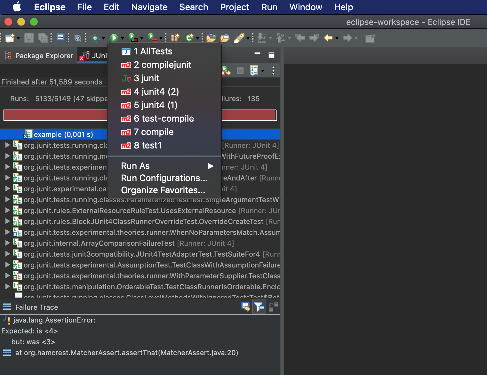
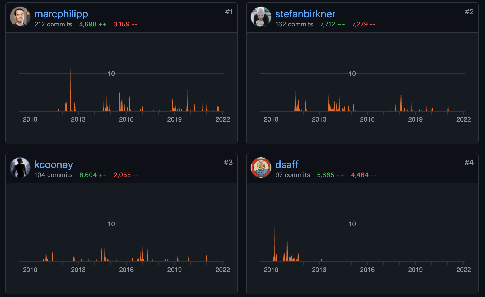
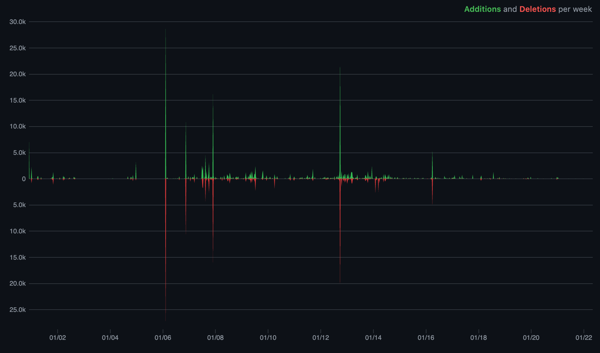

# Rendu projet GL

## Binome
- Louis DELOFFRE
- Sabrina KERNOUF

# 1. Présentation globale JUNIT4

## 1.1.  Utilité du projet
- Junit est un framework opensource pour JAVA. Cet outil aide au developpement et à l'exécution de tests unitaires. Depuis Java 5, d'importantes évolutions ont été apportées à JUnit. Les dernières versions de JUnit ont donc changé de numéro majeur de version pour passer de JUnit 3.x à JUnit 4.x.
    * Le but de ce logiciel est d'automatiser les tests .
- Les fonctionnalités proposées par Junit sont : 
* La création d'instance de classe et de tout autre objet nécessaire aux tests.
* Produire un appel des méthodes à tester avec les paramètres nécessaires.
* Lever une exception en cas d'échec de la comparaison entre le résultat obtenu et le résultat attendu. 

- Pour mener à bien le lancement du projet, il existe plusieurs façon :
    * Compiler les classes utilisées par les tests (terminal) 
        
        ```java
         javac <nomDeClasse>.java 
        ```

    * Compiler les classes de test (terminal)
        ```java
        javac -cp .:junit-4.<version>.jar:hamcrest-core-1.3.jar <nomDeClasseTest>.java (pour macOs/Linux)
        javac -cp .;junit-4.<version>.jar;hamcrest-core-1.3.jar <nomDeClasseTest>.java (pour window)
        ```
    * Directement avec un IDE tel que Eclipse ou IntelliJ par le bouton prévu à cet effet.
    
    
    * Par maven (projet préalablement sous maven)
        * mvn clean (si projet déjà compilé)
        * mvn install
        * mvn test

- Les sorties du logiciel : 
    * L'exécution global de tout les tests avec son nombre :
        * On distingue : 
            * Test Failure
            * Test Errors
            * Test Skipped
    ```
    Tests run: 1108, Failures: 0, Errors: 0, Skipped: 5
    ```

## 1.2. Description du projet

- Le README est présent et fournis plusieurs topics : 
    * Un wiki <https://github.com/junit-team/junit4/wiki> 


# 2. Historique du logiciel

## Analyse du git 

L'équipe est composées de 4 développeurs et le dépôt de plus de 150 contributeurs.
Tout les collaborateurs n'ont pas une fréquence régulière ni dans les commits ou dans le temps, certain contributeurs ont produit des commits durant 2jours et on disparu ensuite. En revanche les 4 développeurs identifiés dans le pom.xml 3 d'entre eux ont eu une contribution régulière et équitable tout au long du projet.



On constate que le dépôt git a été créé le 03 decembre 2001, mais les commits conséquents n'ont été réalisés qu'en mars 2006. 
Pour ce qui est de l'activité sur le projet le dernier commit est actuellement en décembre 2021 mais nous pouvons remarquer Aucune issues ni de merge request est en attente. De plus la dernière releaseNote date de 2020 on en déduit que le projet n'est plus d'actualité.



Sur le graphique récupéré sur le projet github nous remarquons que la contribution a été faite sur certaines périodes. 
Nous retrouvons 4 branches sur le projet nommées respectivement : 
- main (pour la branche principal)
- gh-pages 
- immutable-description
- fixtures
La branche fixtures n'a pas eu d'activité depuis 6ans on en déduit qu'elle à dû être abandonner lors de la réalisation du projet même si elle contient 436 commits.
Immutable-description suis le même schéma que celle de fixture avec comme dernière mise à jour il y a 3ans. 
Les deux n'ont pas passé la pipeline.
Seul la branch gh-pages a eu une mise à jour récente avec la pipeline au vert.

### Pull request 

Les pull requests ont été utilisé dans le projet. 18 restent encore ouverts. On y retrouve des fix de bug, des features, du refactoring.

# 4 Architecture logicielle
## 4.1 Utilisation de bibliothèques extérieures.

- Le projet implémente la librairie JAVA ainsi que d'autre tel que Hamcrest-core-1.3 & Hamcrest-library qu'on retrouve cité dans le pom.xml, dans les dépendances maven.


- Toute les dépendances sont utilisés :
    - hamcrest permettant d'écrire déclarativement les règles de correspondance
    - JAVA qui est composé de JUNIT
    
- Nous n'avons pas de dépendance duppliquée vu le nombre. Hamcrest sert à déclarer des règles de correspondance.

## 4.2 Organisation en paquetages.

- Dans les différents dossier sources nous avons : 
    - 32 paquetages dans le src/main/java
    - 44 paquetages dans le src/test/java
    - **76 paquetages au total**

- Il y a dans le dossier src/main/java 2 catégories de paquatages : 
    - Junit
    - org/Junit
- Il ne s'appelle qu'entre eux. Le paquetage runner et extensions communique uniquement avec le paquetage framework.
